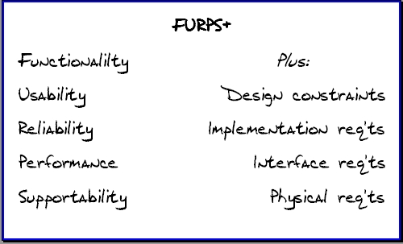

# Запити зацікавлених осіб

## Вступ

Проаналізувавши предметну область та зробивши порівняльну характеристику існуючих засобів вирішення поставленого завдання[[1]](/requirements/state-of-the-art.html), ми приступаємо до визначення основних вимог до нашої системи. Цей документ містить основні бізнес-сценарії використання системи зацікавленими особами та вівповідні до них вимоги FURPS, а також короткий опис продукту.

### Мета

Перед тим як починати розроблювати СУБД треба визначити, ким будуть користувачі системи, чого вони вимагають від неї, адже кінцева мета проекту - задовольнити очікування користувачів.

### Контекст

У цьому документі розглядаються основні вимоги до нашої системи упраління проетами "Just Chill", що буде легкою для інтеграції користувачів, зручною у використанні та при цьому надасть найбільш широке коло можливостей для автоматизації процесів управління проектами.

### Основні визначення та скорочення

[Бізнес-процес](https://uk.wikipedia.org/wiki/%D0%91%D1%96%D0%B7%D0%BD%D0%B5%D1%81-%D0%BF%D1%80%D0%BE%D1%86%D0%B5%D1%81) (англ. Business Process) — будь-яка діяльність, що має вхідний продукт, додає вартість до нього, та забезпечує вихідний продукт для внутрішнього або зовнішнього споживача.

[Бізнес-актор](https://www.google.com/search?q=%D1%87%D1%82%D0%BE+%D1%82%D0%B0%D0%BA%D0%BE%D0%B5+%D0%B1%D0%B8%D0%B7%D0%BD%D0%B5%D1%81+%D0%B0%D0%BA%D1%82%D0%BE%D1%80&rlz=1C1ONGR_deDE1019DE1020&sxsrf=AJOqlzWMeJdezneP-iUfrrMl1BNHURo6lw%3A1679329706608&ei=qokYZNPsJIOWrwSoiqDQCg&ved=0ahUKEwjT6f3U9ur9AhUDy4sKHSgFCKoQ4dUDCA8&uact=5&oq=%D1%87%D1%82%D0%BE+%D1%82%D0%B0%D0%BA%D0%BE%D0%B5+%D0%B1%D0%B8%D0%B7%D0%BD%D0%B5%D1%81+%D0%B0%D0%BA%D1%82%D0%BE%D1%80&gs_lcp=Cgxnd3Mtd2l6LXNlcnAQAzIFCCEQoAEyBQghEKABMgUIIRCgATIFCCEQoAE6CggAEEcQ1gQQsAM6CAgAEIAEEMsBOggIABAWEB4QDzoGCAAQFhAeOgQIIRAVSgQIQRgAUN0EWOIJYOkRaAFwAHgAgAGgAYgBogWSAQMwLjWYAQCgAQHIAQbAAQE&sclient=gws-wiz-serp#:~:text=%D0%91%D0%B8%D0%B7%D0%BD%D0%B5%D1%81%2D%D0%B0%D0%BA%D1%82%D0%B5%D1%80%20(business%20actor)%20%E2%80%93%20%D0%B8%D0%BD%D0%B4%D0%B8%D0%B2%D0%B8%D0%B4%D1%83%D1%83%D0%BC%2C%20%D0%B3%D1%80%D1%83%D0%BF%D0%BF%D0%B0%2C%20%D0%BE%D1%80%D0%B3%D0%B0%D0%BD%D0%B8%D0%B7%D0%B0%D1%86%D0%B8%D1%8F%2C%20%D0%BA%D0%BE%D0%BC%D0%BF%D0%B0%D0%BD%D0%B8%D1%8F%20%D0%B8%D0%BB%D0%B8%20%D1%81%D0%B8%D1%81%D1%82%D0%B5%D0%BC%D0%B0%2C%20%D0%BA%D0%BE%D1%82%D0%BE%D1%80%D1%8B%D0%B5%20%D0%B2%D0%B7%D0%B0%D0%B8%D0%BC%D0%BE%D0%B4%D0%B5%D0%B9%D1%81%D1%82%D0%B2%D1%83%D1%8E%D1%82%20%D1%81%20%D0%BC%D0%BE%D0%B4%D0%B5%D0%BB%D0%B8%D1%80%D1%83%D0%B5%D0%BC%D0%BE%D0%B9%20%D0%B1%D0%B8%D0%B7%D0%BD%D0%B5%D1%81%2D%D1%81%D0%B8%D1%81%D1%82%D0%B5%D0%BC%D0%BE%D0%B9%2C%20%D0%BD%D0%BE%20%D0%BD%D0%B5%20%D0%B2%D1%85%D0%BE%D0%B4%D1%8F%D1%82%20%D0%B2%20%D0%BD%D0%B5%D0%B5%2C%20%D1%82.%20%D0%B5.%20%D0%BD%D0%B5%20%D1%8F%D0%B2%D0%BB%D1%8F%D1%8E%D1%82%D1%81%D1%8F%20%D1%87%D0%B0%D1%81%D1%82%D1%8C%D1%8E%20%D0%BC%D0%BE%D0%B4%D0%B5%D0%BB%D0%B8%D1%80%D1%83%D0%B5%D0%BC%D0%BE%D0%B9%20%D1%81%D0%B8%D1%81%D1%82%D0%B5%D0%BC%D1%8B.) (business actor) – індивідуум, група, організація, компанія чи система, які взаємодіють з модельованою бізнес-системою, але не входять до неї, тобто не є частиною системи, що моделюється.

[Бізнес-працівник](https://www.tesestec.com.br/pasteurjr/rup/process/modguide/md_bwk.htm#:~:text=A%20business%20worker%20represents%20a,in%20business%20use%2Dcase%20realizations.) (business worker) представляє роль або набір ролей у бізнесі. Бізнес-працівник взаємодіє з іншими ролями та маніпулює бізнес-суб’єктами, беручи участь у реалізації бізнес-прецедентів.

[Бізнес-сценарій](https://jgdb.com/dictionary/business-scenario) (business scenario) – це опис ймовірних майбутніх подій і обставин, пов’язаних з бізнесом, який зазвичай ґрунтується на поточних і минулих тенденціях, а також на припущеннях, зроблених на основі цих тенденцій.

FURPS – класифікація вимог до програмних систем.[[2]](https://ru.wikipedia.org/wiki/FURPS)

- **F**unctionality (Функціональність) - те, що хоче клієнт! Зауважте, що це включає потреби, пов’язані з безпекою.

- **U**sability (Зручність використання) - Наскільки ефективним є продукт з точки зору людини, яка повинна його використовувати? Чи це естетично прийнятно? Чи документація точна та повна?

- **R**eliability (Надійність) - Який максимально прийнятний час простою системи? Чи передбачувані невдачі? Чи можемо ми продемонструвати точність результатів? Як відновлюється система?

- **P**erformance (Продуктивність) - Наскільки швидкою вона має бути? Який максимальний час відповіді? Яка пропускна здатність? Яке споживання пам'яті?

- **S**upportability (Підтримуваність) - чи можна тестувати, розширювати, обслуговувати, встановлювати та конфігурувати? Чи можна це контролювати?[[3]](http://agileinaflash.blogspot.com/2009/04/furps.html)

Вимоги були розроблені та представлені Hewlett-Packard. В даний час використовується абревіатура FURPS+.

\+ нагадує нам про кілька додаткових потреб, які можуть виникнути у клієнта:

- Обмеження дизайну - Чи такі речі, як пристрої вводу/виводу чи СУБД, обмежують те, як програмне забезпечення повинно бути створено?

- Вимоги до впровадження - чи потрібно програмістам дотримуватися стандартів? Чи потрібно використовувати TDD (Керована тестами розробка (Test-driven development) — технологія розробки програмного забезпечення, яка використовує короткі ітерації розробки, що починаються з попереднього написання тестів, які визначають необхідні покращення або нові функції.)[[4]](https://uk.wikipedia.org/wiki/%D0%9A%D0%B5%D1%80%D0%BE%D0%B2%D0%B0%D0%BD%D0%B0_%D1%82%D0%B5%D1%81%D1%82%D0%B0%D0%BC%D0%B8_%D1%80%D0%BE%D0%B7%D1%80%D0%BE%D0%B1%D0%BA%D0%B0)? Чи потрібне статистично надійне тестування в контексті чистих приміщень(Cleanroom -це обладнаний простір, у якому підтримується дуже низька концентрація частинок у повітрі . Він добре ізольований, добре контролюється від забруднень і активно очищається.[[5]](https://en.wikipedia.org/wiki/Cleanroom)?

- Вимоги до інтерфейсу - Які вихідні потоки необхідно створити? З якими іншими системами ця система має взаємодіяти? Як часто виробляються потоки?

- Фізичні вимоги - На якому апаратному забезпеченні має бути розгорнута система? 

### Посилання

1. [Аналіз предметної області](/requirements/state-of-the-art.html)
2. [Що таке FURPS?](https://ru.wikipedia.org/wiki/FURPS)
3. [Опис FURPS](http://agileinaflash.blogspot.com/2009/04/furps.html)
4. [TDD](https://uk.wikipedia.org/wiki/%D0%9A%D0%B5%D1%80%D0%BE%D0%B2%D0%B0%D0%BD%D0%B0_%D1%82%D0%B5%D1%81%D1%82%D0%B0%D0%BC%D0%B8_%D1%80%D0%BE%D0%B7%D1%80%D0%BE%D0%B1%D0%BA%D0%B0)
5. [Cleanroom](https://en.wikipedia.org/wiki/Cleanroom))

## Короткий зміст

*[Розділ містить опис того, про що йдеться в еій частині цього документу, що залишилася. 
Також тут описана структура документу.]*

## Характеристика ділових процесів

Щоб розробити модель поведінки нашої системи управління проектами, треба визначити її границі, тобто зовнішні та внутрішні фактори, що будуть впливати на систему та як система повнинна відреагувати на цей вплив.

***Зовнішнім фактором***, тобто бізнес-актором для системи управління проектами буде:
- **Клієнт** (замовник, customer) - взаємодіє з системою управління проектами не безпосередньо, а через бізнес-робітників, він висловлює свої вимоги до проекту, переглядає результати на проміжних стадіях реалізації проекту.

***Внутрішніми факторами***, тобто бізнес-робітниками будуть:
- **Менеджер проектів** (Project Manager) - перетворює вимоги клієнта на конкретні задачі, планує та розділює роботу на відносно незалежні частини, які делегує командам, відстежує результати виконання завдань, управляє ресурсами (часовими, грошовими). Він може управляти одним або декількома проектами.
- **Тімлід** - управляє процесами всередині команди, роподілює роботу між працівниками, стежить за її виконанням згідно умовам, поставленим менеджером проекту.
- **Робітник** (colaborator) - виконує свої завдання, планує виключно свою роботу.
- **Адміністратор системи** - займається технічними питаннями у разі виникнення проблем з використанням інформаційного забезпечення.

---

Розглянемо основні бізнес-сценарії взаємодії учасників бізнес-процесу та інформаційної системи:

|ID| DASHBOARD.DISPLAY|
|:--|:--|
|Назва:|Відобразити дашборд|
|Учасники:|Користувач (менеджер проекту, тімлід або робітник)|
|Передумови:| -Користувач авторизований -Користувач обрав проект|
|Результат:|Поточна інформація про проект у вигляді дашборду|
|Виключні ситуації:|Відсутні|
|Основний сценарій:|1. Користувач натискає кнопку "Dashboard"  2. Користувач обирає потрібні елементи дашборду 3. Система виводить поточну інформацію про проект у вигляді дашборду|

|ID| СHANGE.VIEW|
|:--|:--|
|Назва:|Змінити вигляд|
|Учасники:|Користувач (менеджер проекту, тімлід або робітник)|
|Передумови:| -Користувач авторизований -Користувач обрав проект -Користувач перейшов у розділ блоку завдань|
|Результат:|Змінений вигляд відображення завдань|
|Виключні ситуації:|Відсутні|
|Основний сценарій:|1. Користувач натискає кнопку "View"  2. Система повідомляє про поточний тип відображення (List/Kanban/Roadmap) 3. Користувач обирає тип відображення  4. Система змінює вигляд відображення завдань|

|ID| TASK.FILTER|
|:--|:--|
|Назва:|Відфільтрувати завдання|
|Учасники:|Користувач (менеджер проекту, тімлід або робітник)|
|Передумови:| -Користувач авторизований -Користувач обрав проект -Користувач обрав тип відображення завдань "List"|
|Результат:|Відфільтровані завдання|
|Виключні ситуації:|У проекті нема жодних завдань EX.NO.TASKS|
|Основний сценарій:|1. Користувач натискає кнопку "Filter"(можлива EX.NO.TASKS) 2. Користувач обирає критерій фільтрування 3. Система відображає відфільтровані завдання|

## Короткий огляд продукту

*[Визначається границя системи та категорії її користувачів. Дається загальна характеристика категорій користувачів
системи]*

*[Нижче йде опис FURPS:]*

## Функціональність

*[Functionality (функциональні вимоги)]*

## Практичність

*[Usability (вимоги до зручності роботи)]*

## Надійність

*[Reliability (вимоги до надійності)]*

## Продуктивність

*[Performance (вимоги до продуктивності)]*

## Експлуатаційна придатність

*[Supportability (вимоги до підтримки)]*
