# Тестування працездатності системи

## 1. Усі акаунти бази даних (GET)
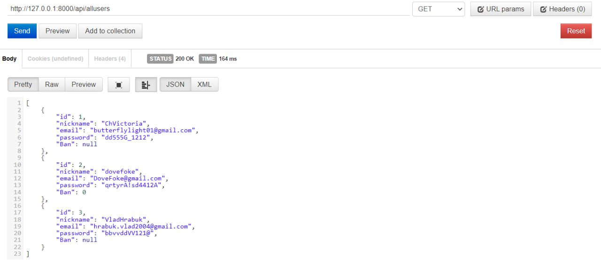
## 2.1 Додавання нового акаунту (POST)
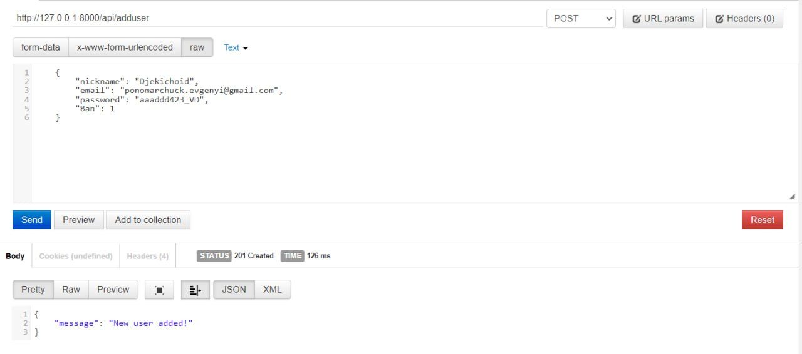
## 2.2 Перевірка, що акаунт додався (GET)
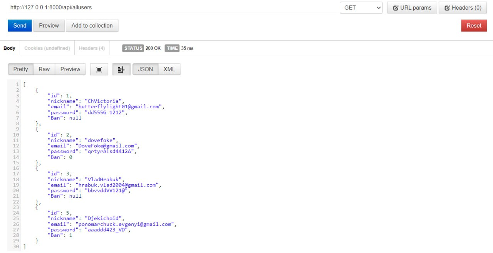
## 2.3 Передача не всіх необхідних даних (POST)
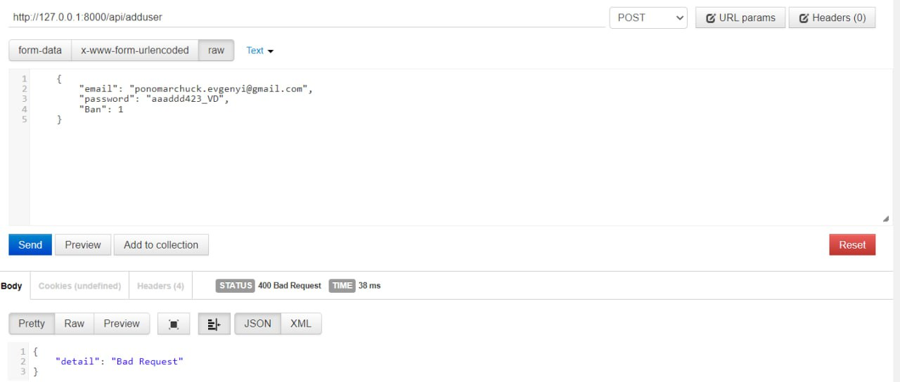
## 3.1 Пошук аккаунту по id (GET)
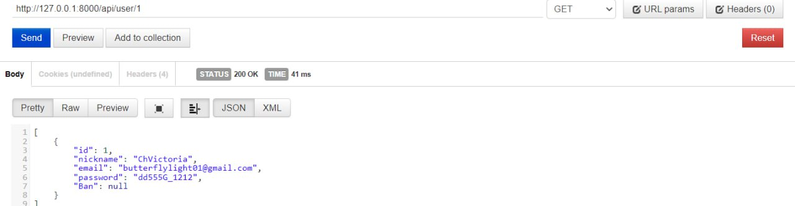
## 3.2 Пошук неіснуючого аккаунту (GET)
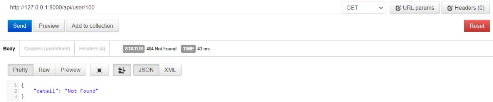
## 4.1 Оновлення аккаунта (PUT)
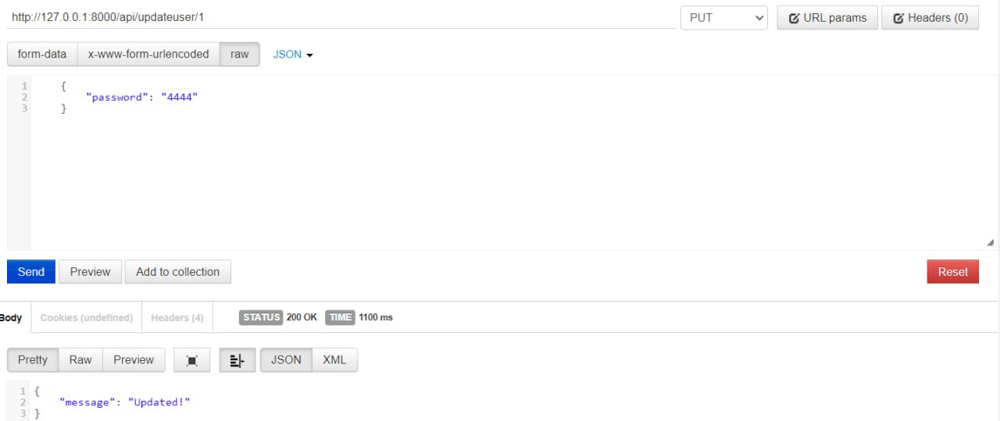
## 4.2 Зміни збережено (GET)
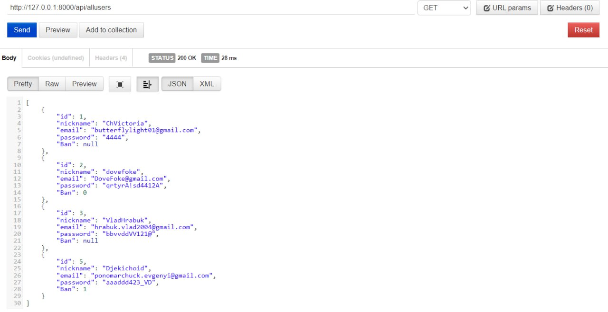
## 4.3 Спроба змінити дані неіснуючого аккаунту (PUT)
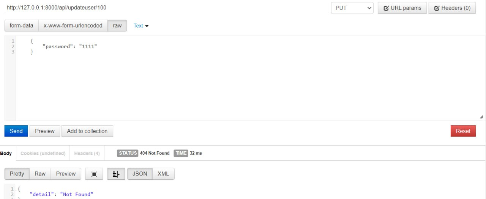
## 5.1 Видалення аккаунту (DELETE)
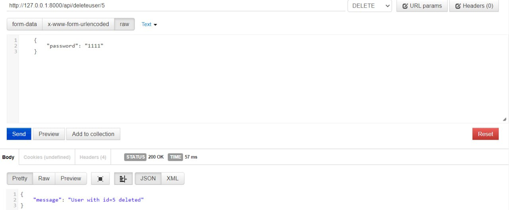
## 5.2 Аккаунту більше нема (GET)
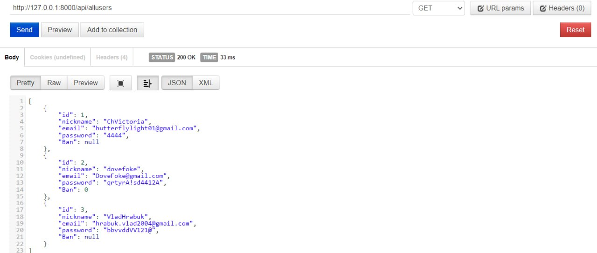
## 5.3 Спроба видалити неіснуючий аккаунт (DELETE)
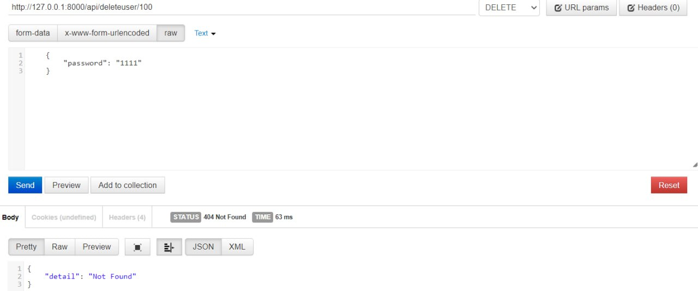